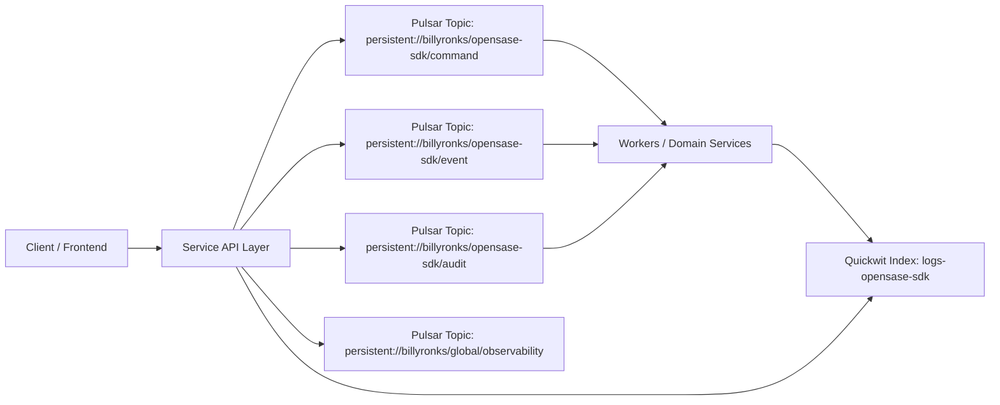

# ARCHITECTURE.md

## Data Flow

## Standard Contracts
- Messaging: Apache Pulsar only for asynchronous inter-service communication.
- Observability: Quickwit ingestion with shared schema (`observability/log-schema.json`).
- Infrastructure: Harvester HCI target with `storageClassName: mayastor` (or Vitastor equivalent).
